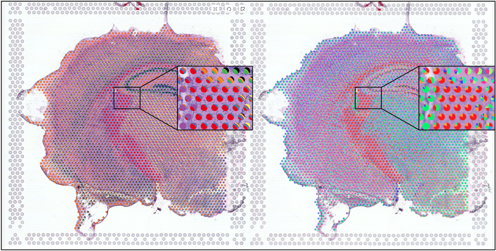

# ScreenShots


  

# Data

This project uses data from [Bio+Med Challenge 2024](http://biovis.net/2024/biovisChallenges_vis/) and [Visium data](https://www.ebi.ac.uk/biostudies/arrayexpress/studies/E-MTAB-11114) from Kleshchevnikov et al., 2022, filter by sample ST8059049

# Requirement

This project uses [Flask](https://flask.palletsprojects.com/en/3.0.x/) to provide data and API and [React](https://react.dev/) to provide data display

1. Install and update using [pip](https://pip.pypa.io/en/stable/getting-started/)

2. Go to RedesignChallenge/Backend folder
3. Create venv environment(**Mac command**)
   ```
   python -m venv venv
   ```
4. You'll need Flask and other related packages installed
   ```
   pip install -r requirements.txt
   ```
5. Run venv environment(**Mac command**)
   ```
   source venv/bin/activate
   ```
6. Run the Flask Application
   ```
   python server.py
   ```
7. Go RedesignChallenge/Frontend folder
8. Run the React
   ```
   npm start
   ```